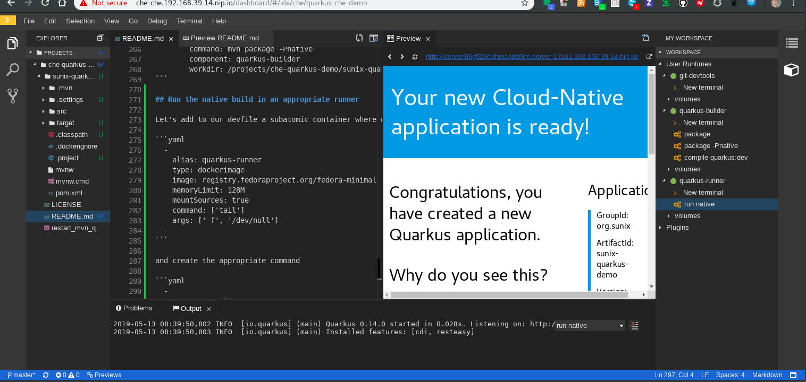

# Quarkus and Che

## how to generate this:
Generate a empty devfile to run quarkus build
```
chectl devfile:generate --name=quarkus-che-demo --language=java --editor=theia-next --dockerImage=quay.io/quarkus/centos-quarkus-maven > quarkus.dev
file
```

Run the devfile
```
chectl workspace:start --devfile=quarkus.devfile
```

That will run a che workspace with quarkus and maven ... let's generate the project and push it.

From the theia-ide container terminal ...
```
cd /projects && git init sunix-demo-quarkus
```

From the quay-io-quarkus-cent terminal ....
```
cd /projects/sunix-demo-quarkus
mvn io.quarkus:quarkus-maven-plugin:0.14.0:create -DprojectGroupId=org.sunix -DprojectArtifactId=sunix-quarkus-demo -DclassName="org.sunix.QuarkusDemoResource" -Dpath="/hello"
```

You can try to run from the terminal
```bash
mvn compile quarkus:dev
```
It will compile the project and start quarkus:dev

Create a script `/projects/che-quarkus-demo/restart_mvn_quarkus_dev.sh` to restart quarkus. It will be used in one of our command:

```bash
#!/bin/bash
cd sunix-quarkus-demo
ps aux | grep 'java' | awk '{print $2}' | xargs kill -9;
mvn compile quarkus:dev
```

change permission of that file:
```bash
chmod +x /projects/che-quarkus-demo/restart_mvn_quarkus_dev.sh
```

Back to the theia-ide container terminal to push everything
```
cd /projects/sunix-demo-quarkus
git remote add sunix https://github.com/sunix/che-quarkus-demo
git checkout master
git add sunix-quarkus-demo/
git add restart_mvn_quarkus_dev.sh
git commit -s -m "quarkus java project skeleton"
git push sunix master
```

For this part I got information from https://quarkus.io/guides/getting-started-guide and https://github.com/quarkusio/quarkus-images
Also the learning portal helped me to learn a bit of Quarkus https://learn.openshift.com/middleware/courses/middleware-quarkus/.

## Enhance the devfile for the developer

Add to the devfile the project to clone and a default quarkus dev command to execute:
```
chectl devfile:generate \
    --name=quarkus-che-demo \
    --language=java \
    --editor=theia-next \
    --dockerImage=quay.io/quarkus/centos-quarkus-maven \
    --git-repo=https://github.com/sunix/che-quarkus-demo \
    --command="./restart_mvn_quarkus_dev.sh" \
 > quarkus.devfile

```
generates that:
```yaml
specVersion: 0.0.1
name: quarkus-che-demo
projects:
  - source:
      type: git
      location: 'https://github.com/sunix/che-quarkus-demo'
    name: che-quarkus-demo
components:
  - alias: quay-io-quarkus-cent
    type: dockerimage
    image: quay.io/quarkus/centos-quarkus-maven
    memoryLimit: 512M
    mountSources: true
    command:
      - tail
    args:
      - '-f'
      - /dev/null
  - type: chePlugin
    alias: java-ls
    id: redhat/java/0.38.0
  - type: cheEditor
    alias: theia-editor
    id: eclipse/che-theia/next
commands:
  - name: ./restart_mvn_quarkus_dev.sh
    actions:
      - type: exec
        command: ./restart_mvn_quarkus_dev.sh
        component: quay-io-quarkus-cent
        workdir: /projects/che-quarkus-demo
```

Let's give more memory to the java language server:
```yaml
  - type: chePlugin
    alias: java-ls
    id: redhat/java/0.43.0
    memoryLimit: 1536M
```

And add a git dockerImage because it is so conveniant to do `git add -p` :) and use `tig`
```yaml
  -
    alias: git-devtools
    type: dockerimage
    image: sunix/git-devtools
    mountSources: true
    memoryLimit: 256M
    command: ['tail']
    args: ['-f', '/dev/null']
```


Last change: share the .m2 repo for the volume to both builder and the java plugin so they share the same repo

*beware, this may not work yet https://github.com/eclipse/che/issues/13318*
```yaml
  - alias: quay-io-quarkus-cent
    type: dockerimage
    image: quay.io/quarkus/centos-quarkus-maven
    memoryLimit: 512M
    mountSources: true
    command: ['tail']
    args: ['-f', '/dev/null']
    volumes:
      - name: mavenrepo
        containerPath: /root/.m2
  - type: chePlugin
    alias: java-ls
    id: redhat/java/0.43.0
    memoryLimit: 2Gi
    volumes:
      - name: mavenrepo
        containerPath: /root/.m2
```

Creating a workspace from that devfile, you should be able to get commands from the `My workspace` view and start the quarkus dev mode. Changing the quarkusdemoresource.
accessing to the application. Openning `QaurkusDemoResource.java` should openned the editor with the fully functional editor and java intellisence.

## Packaging ...

Let's continue improving our devfile, we want to be able to package the app and run the native build.

I have renamed the component `quay-io-quarkus-cent` to `quarkus-builder`, gave it a bit more memory (native compilation needs more). Also renamed the command to `compile quarkus:dev`
```yaml
  - alias: quarkus-builder
    type: dockerimage
    image: quay.io/quarkus/centos-quarkus-maven
    memoryLimit: 2Gi
    mountSources: true
    args: ['-f', '/dev/null']
    volumes:
      - name: mavenrepo
        containerPath: /root/.m2
```
and ...
```yaml
commands:
  -
    name: compile quarkus:dev
    actions:
      - type: exec
        command: ./restart_mvn_quarkus_dev.sh
        component: quarkus-builder
        workdir: /projects/che-quarkus-demo

```

Let's add a new command to perform `mvn package` and `mvn package -Pnative` (for native compilation optimized with GraalVM):
```yaml
commands:
  -
    name: package
    actions:
      - type: exec
        command: mvn package
        component: quarkus-builder
        workdir: /projects/che-quarkus-demo/sunix-quarkus-demo
  -
    name: package -Pnative
    actions:
      - type: exec
        command: mvn package -Pnative
        component: quarkus-builder
        workdir: /projects/che-quarkus-demo/sunix-quarkus-demo
```

Relaunching a new workspace from it, we should be able to to run the native Quarkus compilation and produce the executable. Basically followed https://quarkus.io/guides/building-native-image-guide.

To recap, my devfile looks like:

```yaml
specVersion: 0.0.1
name: quarkus-che-demo
projects:
  - source:
      type: git
      location: 'https://github.com/sunix/che-quarkus-demo'
    name: che-quarkus-demo
components:
  -
    alias: quarkus-builder
    type: dockerimage
    image: quay.io/quarkus/centos-quarkus-maven
    memoryLimit: 2Gi
    mountSources: true
    command: ['tail']
    args: ['-f', '/dev/null']
    volumes:
      - name: mavenrepo
        containerPath: /root/.m2
  -
    type: chePlugin
    alias: java-ls
    id: redhat/java/0.43.0
    memoryLimit: 1536M
  -
    alias: git-devtools
    type: dockerimage
    image: sunix/git-devtools
    mountSources: true
    memoryLimit: 256M
    command: ['tail']
    args: ['-f', '/dev/null']
  -
    type: cheEditor
    alias: theia-editor
    id: eclipse/che-theia/next
commands:
  -
    name: compile quarkus:dev
    actions:
      - type: exec
        command: ./restart_mvn_quarkus_dev.sh
        component: quarkus-builder
        workdir: /projects/che-quarkus-demo
  -
    name: package
    actions:
      - type: exec
        command: mvn package
        component: quarkus-builder
        workdir: /projects/che-quarkus-demo/sunix-quarkus-demo
  -
    name: package -Pnative
    actions:
      - type: exec
        command: mvn package -Pnative
        component: quarkus-builder
        workdir: /projects/che-quarkus-demo/sunix-quarkus-demo
```

## Run the native build in an appropriate runner

Let's add to our devfile a subatomic container where we are going to run our freshly built subatomic Java app

```yaml
  -
    alias: quarkus-runner
    type: dockerimage
    image: registry.fedoraproject.org/fedora-minimal
    memoryLimit: 128M
    mountSources: true
    command: ['tail']
    args: ['-f', '/dev/null']
  -
```

and create the appropriate command

```yaml
  -
    name: run native
    actions:
      - type: exec
        command: ./sunix-quarkus-demo-1.0-SNAPSHOT-runner -Dquarkus.http.host=0.0.0.0
        component: quarkus-runner
        workdir: /projects/che-quarkus-demo/sunix-quarkus-demo/target
```

